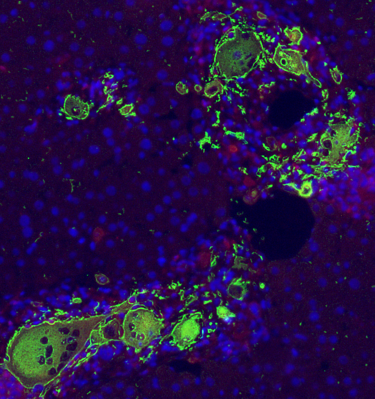
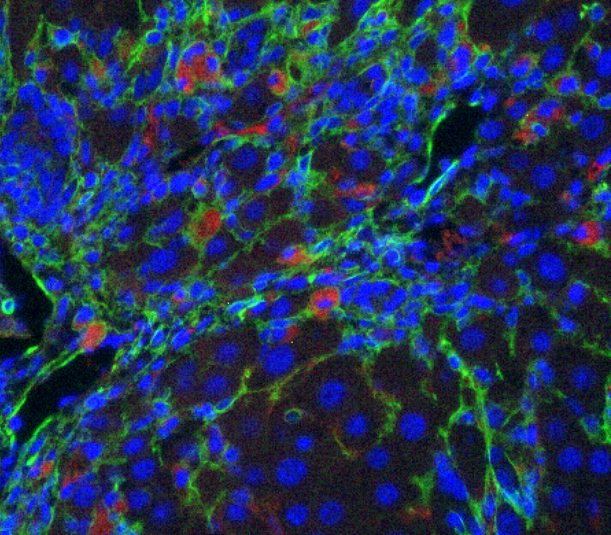

## Overview
Cellular senescence is a stress response program triggered in response to DNA damage. The senescence program has both  cell-intrinsic and cell-extrinsic components. Thus, on one hand it activates the tumor suppressors p53 and RB leading to stable cell cycle arrest. On the other, senescent cells also secrete the senescence-associated secretory phenotype (SASP) that recruits senescence-clearing immune cells to restore tissue homeostasis. 

## Elucidating senescence immune surveillance

The composition of the SASP and the surface proteins expressed by senescent cells are highly heterogeneous and context-dependent as are the immune cells that are recruited to target senescent cells in different tissues. Therefore, how immune cells are recruited and recognize senescent cells is currently unclear. When the immune system is not able to clear these cells, such as in aging or in cancer, they accumulate and generate a chronic proinflammatory microenvirontment that leads to pathology. How senescent cells escape immune surveillance and which specific secreted factors contribute to disease in different settings is unclear. Our lab is interested in understanding the physiologic mechanisms of immune surveillance and how  these are derailed in cancer, aging and age-related pathologies. To address these questions our lab  is applying a variety of proteomic and immunological approaches coupled to novel somatic mouse models of disease.

## Developing immune-based senolytic threapies

Genetic mouse models have shown the therapeutic promise of targeting senescent cells in cancer and age-related pathologies. Our lab seeks to develop strategies to eliminate senescent cells (senolytics) that harness the body immune system. In particularly, we are interested in chimeric antigen receptor T cells (CAR T cells). We recently identified uPAR as a surface molecule upregulated on senescent cells and developed the first CAR T cells able to target senescent cells. Our current efforts focus on the optimization of senolytic cellular therapy in terms of target, cell type and CAR designs with the ultimate goal of reaching the clinical development of senolytic cellular therapy in cancer and age-related pathologies. 

