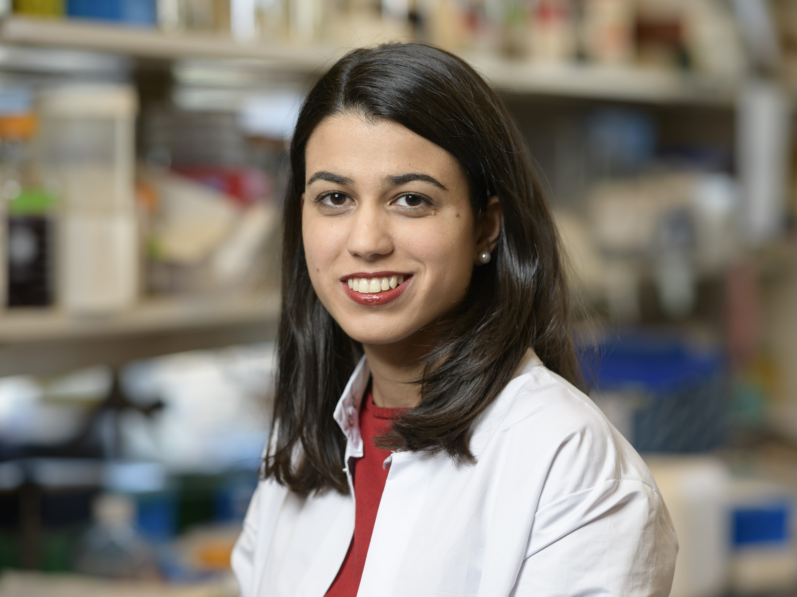

# Lab Members
## Principal Invesitgator
## Corina Amor, M.D., Ph. D.

Corina joined Cold Spring Harbor Laboratory as an Independent Fellow in January 2022. The CSHL Fellows program offers promising young investigators the opportunity to establish their own research group shortly after completing graduate work. Corina received an M.D. from Universidad Complutense de Madrid in Spain in 2017 and then enrolled in the Gerstner Sloan Kettering Graduate School at Memorial Sloan Kettering Cancer Center in NY where she earned a Ph.D conducting her doctoral research in the laboratory of Scott W Lowe. Her thesis work focused on developing immune-based strategies to target senescent cells. This included studies to identify surface markers of senescent cells, pioneering the use of CAR T cells as senolytics and the development of flexible somatic cancer mouse models. Her work on senolytic CAR T cells was widely highlighted in leading journals in the field and earned her the Chairman’s Prize Award from Memorial Sloan Kettering. In 2022 Corina established her own research group whose goal is to study cellular senescence in cancer and aging with a focus on senescence immune surveillance and the development of  cell-based senolytics.

## Staff