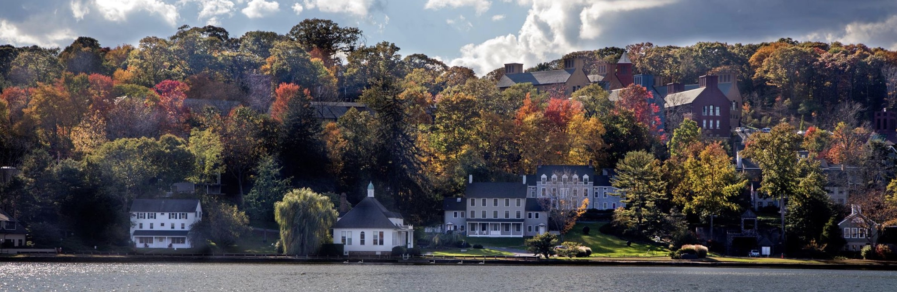

<!-- TODO: Map Pending-->

<!-- - Phone: 123-456-7890
- Mail: [corina@awesome_lab.com](mailto:corina@awesome_lab.com)
 -->

### Corina Amor, Principal Investigator
- Phone: 516-367-8459
- E-mail: [amor@cshl.edu](mailto:amor@cshl.edu)

### Sabrina Boettcher, Administrative Assistant
- Phone: 516-367-8421
- E-mail: [boettche@cshl.edu](mailto:boettche@cshl.edu)

### Mailing Address

```
Amor Lab
1 Bungtown Road
McClintock Laboratory | Room 
Cold Spring Harbor Laboratory
Cold Spring Habor
NY 11724
```

## Join Us!

We are currently seeking highly motivated postdoctoral fellows, graduate and master’s students and technicians to join us.

To learn more about ongoing research projects and apply, please email your CV, brief description of research experience and future interests and the names of 3 references to amor@cshl.edu 

## Working at CSHL

Located on Long Island, CSHL is easily accessible from NYC via the Long Island Rail Road in under an hour.

CSHL offers competitive salaries and benefits programs, access to an affordable on-site childcare center and career development opportunities (visit [resources](https://www.cshl.edu/research/postdoctoral-research/
)).

CSHL  has a friendly and collaborative environment that fosters scientific discussions. Its [Meetings and Courses program](https://meetings.cshl.edu/index.aspx) provides further opportunity to stay up to date and interact with researchers from different fields. In addition CSHL hosts non-scientific events such as concerts, lecture programs and a wide range of outdoors and indoors activities such as private beach, swimming pool, canoeing, sailing, volleyball and tennis courts.
